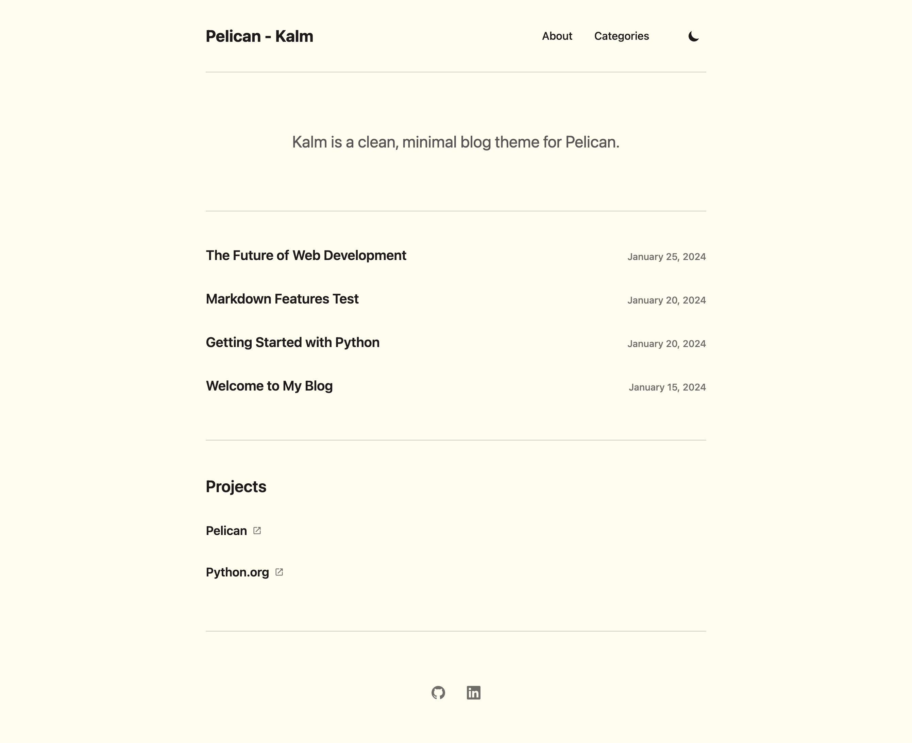
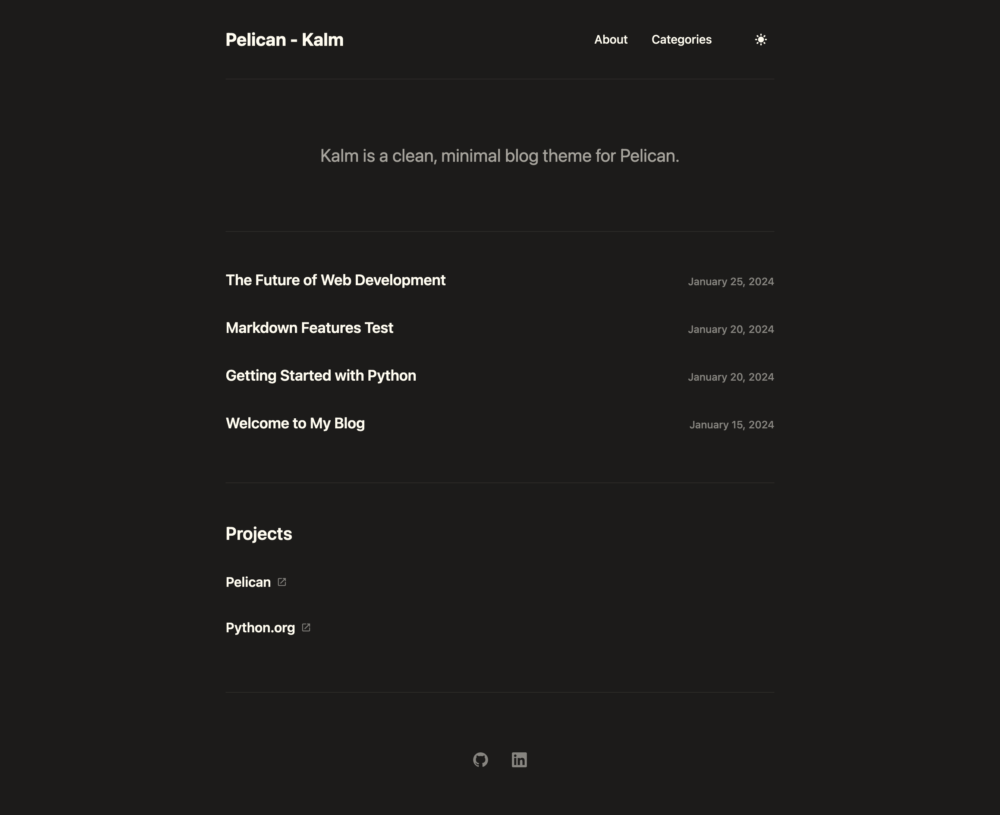

# Kalm - Pelican Theme

Kalm (Dutch for 'calm') is a clean, minimal blog theme for Pelican. The theme features a responsive design, dark/light mode based on system preference detection and a manual toggle.

Created by [Fabian van Luyn](https://github.com/fabian-vl). Inspired by the [Gatsby Minimal Blog theme](https://github.com/LekoArts/gatsby-starter-minimal-blog) by LekoArts and using the [Flexoki Color Scheme](https://github.com/kepano/flexoki). 


## Installation

1. Clone or download this theme to your Pelican themes directory
2. Update your `pelicanconf.py` to use the theme:

   ```python
   THEME = 'themes/kalm'
   ```

## Configuration

### Basic Settings

Add these settings to your `pelicanconf.py`:

```python
# Theme configuration
THEME = 'themes/kalm'

# Site information
SITENAME = 'Your Site Name'
SITEURL = 'https://yoursite.com'
AUTHOR = 'Your Name'
SITEDESCRIPTION = 'Your site description'

# Social links
SOCIAL = (
    ('GitHub', 'https://github.com/yourusername'),
    ('LinkedIn', 'https://linkedin.com/in/yourprofile'),
    ('Twitter', 'https://twitter.com/yourusername'),
    ('Instagram', 'https://instagram.com/yourusername'),
    ('Mastodon', 'https://mastodon.social/@yourusername'),
    ('Email', 'mailto:your@email.com'),
    ('YouTube', 'https://youtube.com/yourchannel'),
    ('RSS', 'https://yoursite.com/feeds/all.atom.xml'),
)

# Menu settings
DISPLAY_PAGES_ON_MENU = True
DISPLAY_CATEGORIES_ON_MENU = True
DISPLAY_TAGS_ON_MENU = True
DISPLAY_HOME_ON_MENU = True

# Homepage settings
DISPLAY_AUTHOR_ON_HOMEPAGE = True
DISPLAY_LINKS_ON_HOMEPAGE = True
HOMEPAGE_ARTICLES_COUNT = 5  # Number of articles to show on homepage (default: 5)

# Article settings
DISPLAY_CATEGORY_ON_POST = True

# Copyright
COPYRIGHT = True
```


## Customization

- Theme-specific settings include display options on homepage and in menu (see above)
- Colors: The theme uses CSS custom properties for easy customization
- Typography: The theme uses system fonts (with fall-backs)
- Social Media Icons: The theme includes built-in SVG icons for popular social media platforms, see the list above. Add your social links to the `SOCIAL` tuple in your `pelicanconf.py` file.

## License & Credits

This theme is licensed under the MIT License. See the LICENSE file for details. 

- Inspired by [Gatsby Minimal Blog](https://github.com/LekoArts/gatsby-starter-minimal-blog) by LekoArts
- Color scheme based on [Flexoki](https://github.com/kepano/flexoki) by kepano
- Built for [Pelican](https://getpelican.com/) static site generator

## Screenshots



